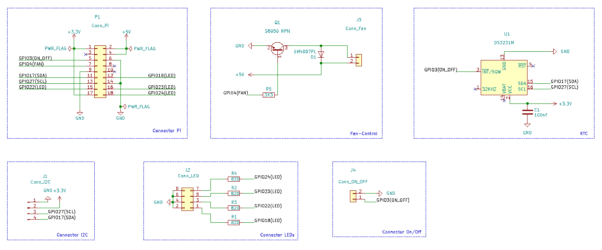
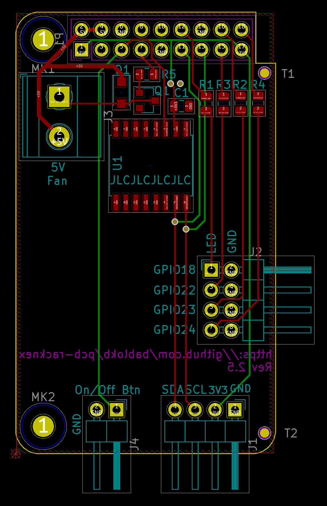
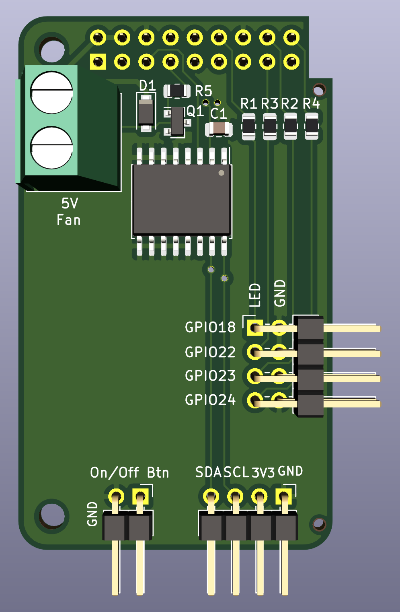

pcb-racknex
=============

This project contains the KiCAD-project-files for a  small pcb
supporting the Pi-racks from <https://racknex.com/rackmount/usemount/raspberry-pi-rack-kits/>.
The KiCAD-sources are in the sub-directory [pcb-racknex](pcb-racknex), production-files with
gerber-layers and drill-hole files are in the sub-directory [production](production).

Schematic
---------

Layout
------

3D-View
-------

